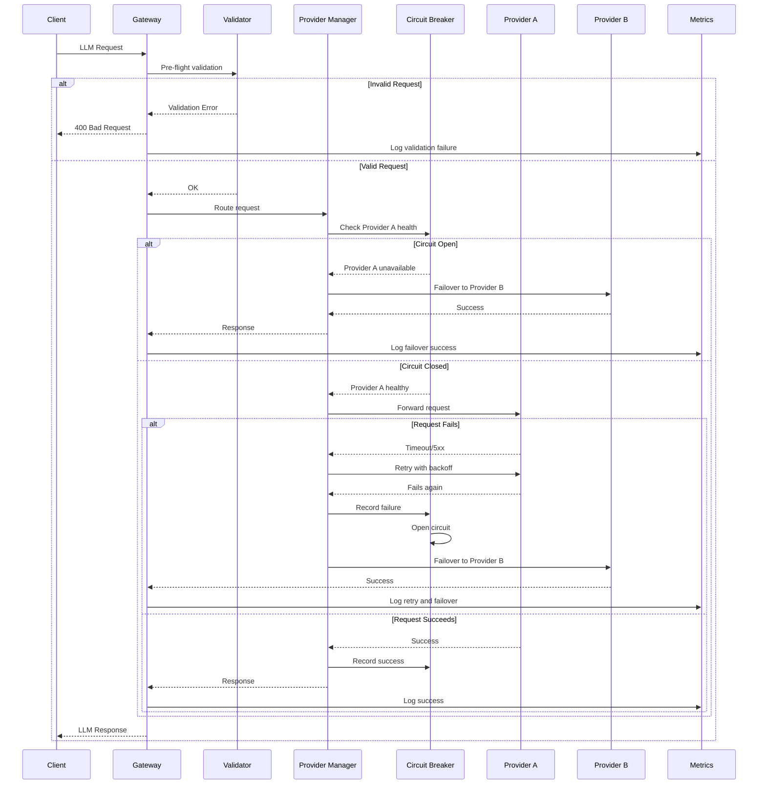
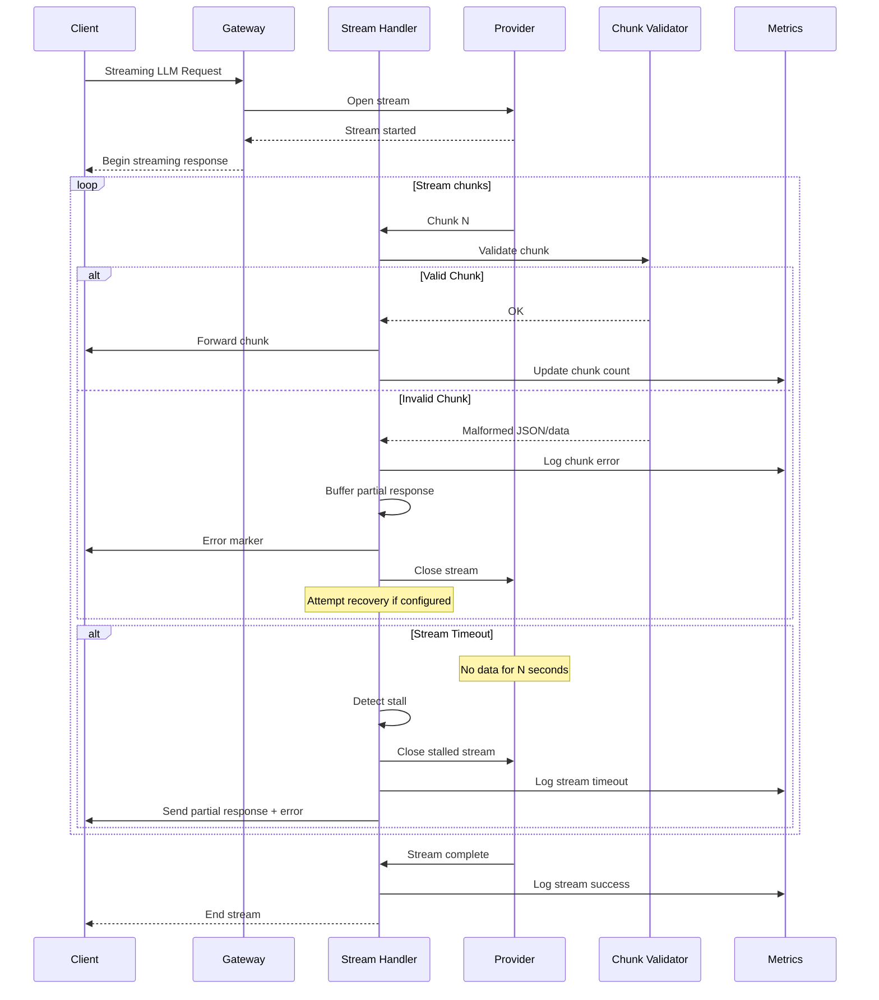

# Langdock LLM Reliability System MVP

## Architecture Overview

A Go-based LLM gateway that sits between clients and multiple LLM providers, implementing reliability patterns and observability.

### Core Components

1. **Gateway Service** (`cmd/gateway/main.go`)

   - HTTP server accepting LLM requests
   - Request validation middleware
   - Provider selection and routing
   - Streaming response handling

2. **Provider Client** (`internal/provider/client.go`)

   - Abstraction for multiple LLM providers (OpenAI, Anthropic, etc.)
   - Retry logic with exponential backoff
   - Circuit breaker pattern
   - Streaming support with chunk validation

3. **Request Validator** (`internal/validator/validator.go`)

   - Pre-flight validation (schema, token limits)
   - Mid-stream validation for structured outputs
   - Token counting utilities

4. **Observability** (`internal/observability/`)

   - Metrics collection (Prometheus format)
   - Request tracing (correlation IDs)
   - Structured logging
   - Health endpoints

5. **Provider Manager** (`internal/provider/manager.go`)

   - Provider health tracking
   - Failover logic
   - Load balancing across healthy providers

### Key Features to Demonstrate

- **Provider Failures**: Retry with exponential backoff, circuit breakers, automatic failover
- **Request Validation**: Pre-flight checks + mid-stream validation for structured outputs
- **Streaming Reliability**: Chunk validation, stream recovery, partial response handling
- **Observability**: Metrics endpoint, request tracing, structured logs

### Technology Stack

- **Language**: Go (concurrent, good for streaming)
- **HTTP Framework**: Gin or standard library
- **Metrics**: Prometheus client library
- **Storage**: In-memory for MVP (can add Redis later)
- **Docker**: Multi-stage build, docker-compose for local setup

### Project Structure

```
langdock/
├── cmd/
│   └── gateway/
│       └── main.go
├── internal/
│   ├── gateway/
│   │   ├── handler.go
│   │   └── middleware.go
│   ├── provider/
│   │   ├── client.go
│   │   ├── manager.go
│   │   ├── circuit_breaker.go
│   │   └── retry.go
│   ├── validator/
│   │   └── validator.go
│   └── observability/
│       ├── metrics.go
│       ├── tracer.go
│       └── logger.go
├── pkg/
│   └── models/
│       └── request.go
├── docker-compose.yml
├── Dockerfile
├── go.mod
└── README.md
```

### Implementation Priorities

1. **Phase 1**: Basic gateway + single provider client with retries
2. **Phase 2**: Multi-provider support + circuit breakers + failover
3. **Phase 3**: Request validation (pre-flight + mid-stream)
4. **Phase 4**: Streaming reliability + chunk validation
5. **Phase 5**: Observability (metrics, tracing, logging)
6. **Phase 6**: Docker setup + documentation

### Request Flow Diagrams

**Provider Failure & Recovery Flow**



**Streaming Failure & Recovery Flow**



### Provider Strategy (Hybrid Approach)

**Mock Providers (Demo Mode)**

- Controllable failure scenarios: timeout, 5xx errors, rate limits, stream stalls
- Configurable failure rates and latency
- No API keys required for demo
- Pre-configured scenarios for predictable demonstrations

**Real Providers (Production Mode)**

- OpenAI implementation using same interface
- Demonstrates architecture works with actual APIs
- Code exists but not used during demo (requires API keys)

**Environment Variable**

- `DEMO_MODE=true`: Uses mock providers (default for demo)
- `DEMO_MODE=false`: Uses real providers (requires API keys)

**Interview Presentation**

- Demo runs entirely with mocks (predictable, no costs)
- Show real provider code to demonstrate production readiness
- Emphasize interface-based design allows seamless switching

### Design Decisions

- **In-memory state**: Simple for MVP, can be replaced with Redis/DB
- **Circuit breaker**: Simple state machine (closed/open/half-open)
- **Retry strategy**: Exponential backoff with jitter, configurable max attempts
- **Streaming**: Buffered chunks with validation, timeout detection
- **Metrics**: Prometheus format, exposed on `/metrics` endpoint
- **Tracing**: Correlation IDs passed through request lifecycle
- **Provider abstraction**: Interface-based design supports both mock and real providers

### Demo Scenarios

1. **Provider failure recovery**: Simulate timeout, show retry + failover
2. **Rate limiting**: Show circuit breaker activation
3. **Invalid request**: Show pre-flight validation rejection
4. **Streaming failure**: Show mid-stream recovery
5. **Observability**: Show metrics dashboard and request traces

### Time Estimate

- **Day 1 (Sunday evening)**: Core gateway + provider client + retries (~3-4 hours)
- **Day 2 (Monday evening)**: Circuit breakers + multi-provider + failover (~2-3 hours)
- **Day 3 (Tuesday evening)**: Validation + streaming reliability (~2-3 hours)
- **Day 4 (Wednesday evening)**: Observability + Docker + polish (~2-3 hours)
- **Thursday**: Review and prepare presentation

**Total**: ~10-13 hours of focused work, spread across evenings.